# AWS Study Notes - Architecture Documentation

## System Architecture Overview

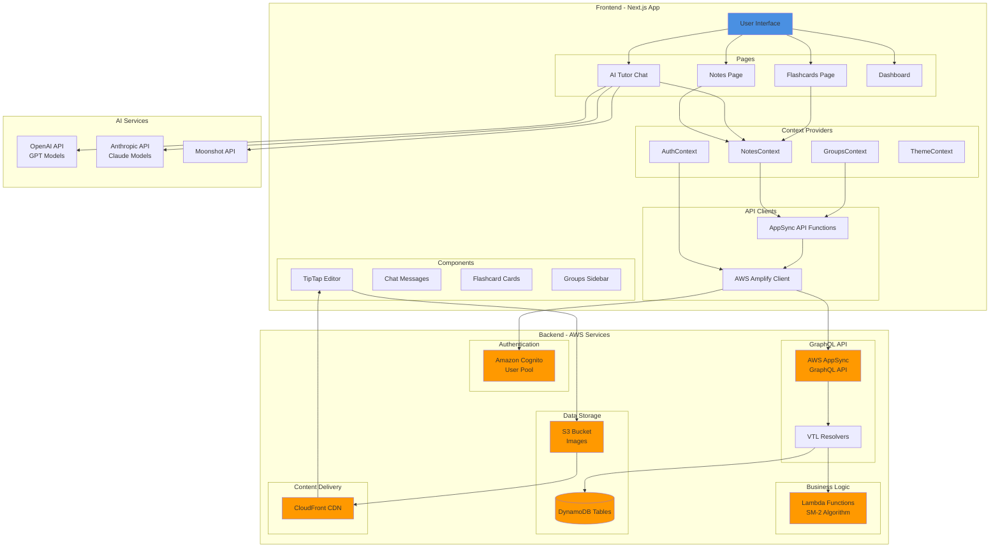

---

## Data Flow Diagrams

### 1. User Authentication Flow

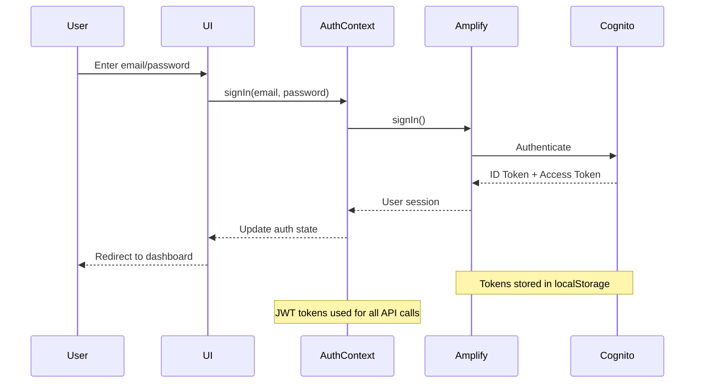

---

### 2. Notes CRUD Operations Flow

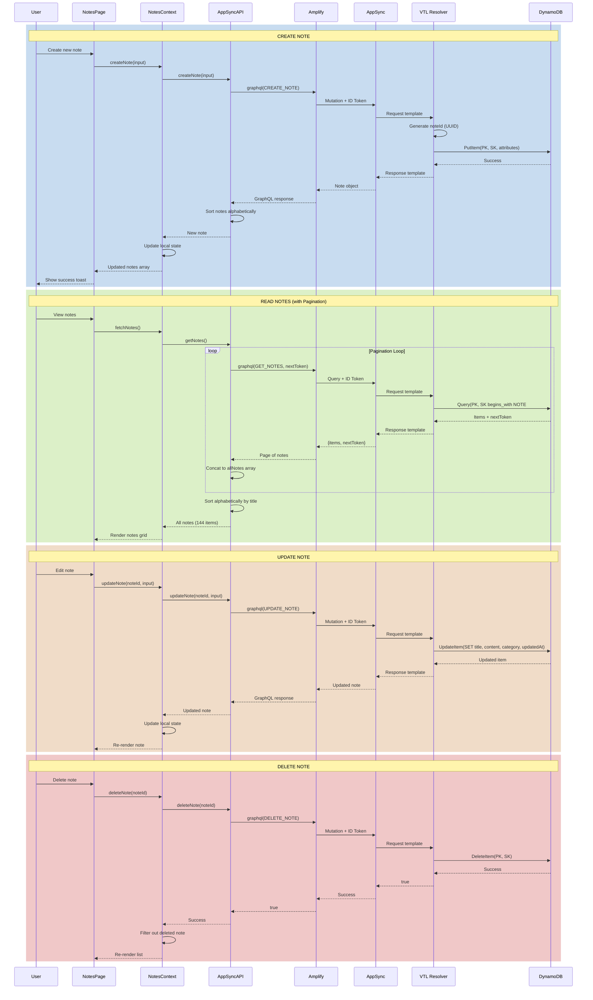

---

### 3. AI Tutor Chat Flow

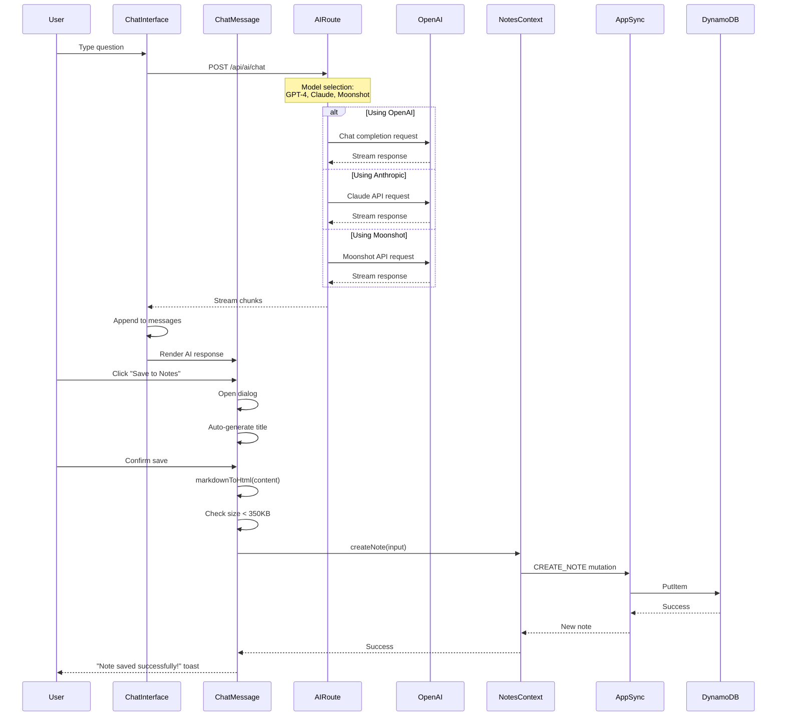

---

### 4. Flashcards Spaced Repetition Flow (SM-2 Algorithm)

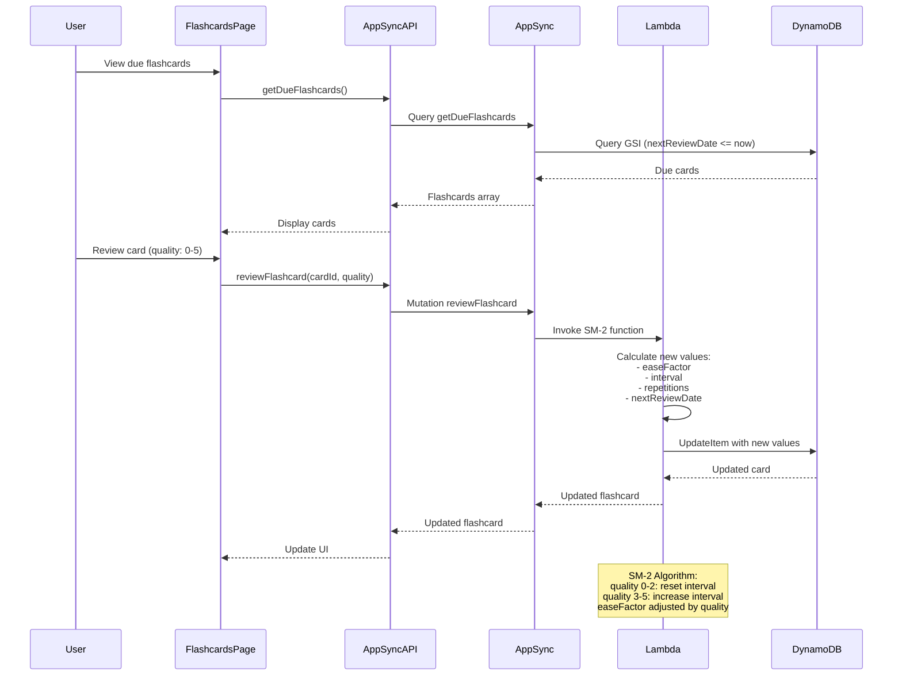

---

### 5. Image Upload Flow

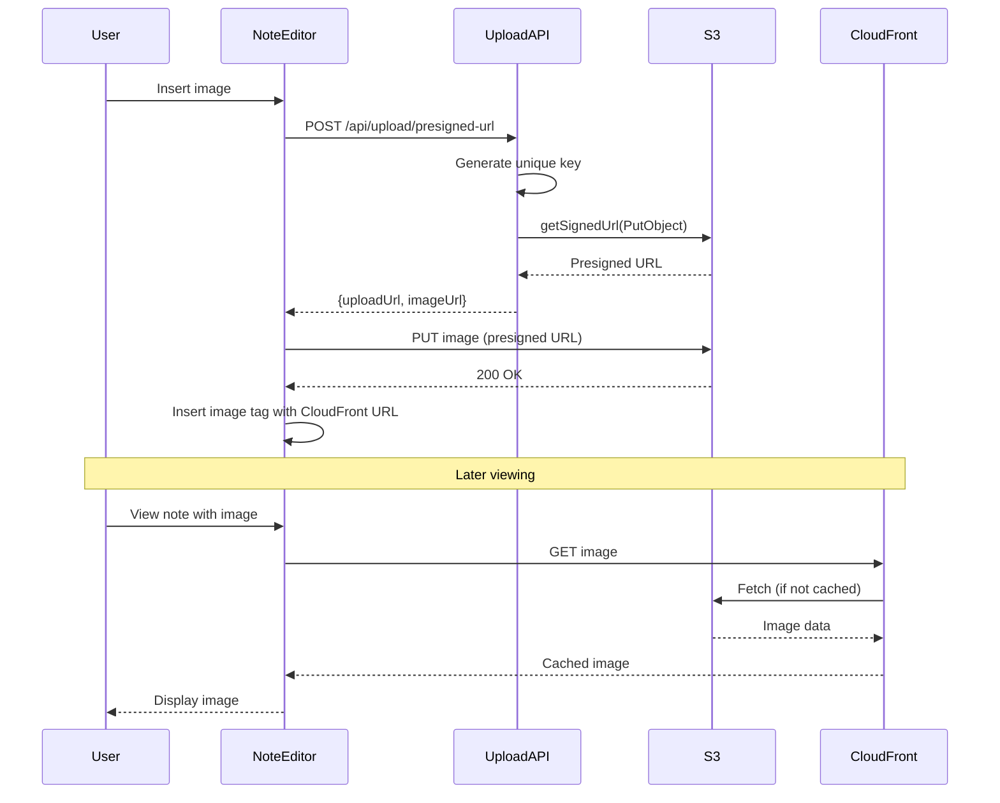

---

## DynamoDB Data Model

```mermaid
erDiagram
    NOTES_TABLE {
        string PK "Cognito user sub (partition key)"
        string SK "NOTE#uuid or GROUP#uuid or SETTINGS#exam (sort key)"
        string noteId "UUID"
        string title "Note title"
        string content "HTML content (from TipTap)"
        string category "Group name"
        stringArray images "S3 image URLs"
        datetime createdAt "ISO 8601"
        datetime updatedAt "ISO 8601"
    }

    FLASHCARDS_TABLE {
        string PK "Cognito user sub (partition key)"
        string SK "CARD#uuid (sort key)"
        string cardId "UUID"
        string deckId "Deck identifier"
        string front "Question"
        string back "Answer"
        string noteId "Optional linked note"
        float easeFactor "SM-2 ease factor (default 2.5)"
        int interval "Days until next review"
        int repetitions "Successful reviews count"
        datetime nextReviewDate "ISO 8601 (indexed)"
        datetime createdAt "ISO 8601"
    }

    NOTES_TABLE ||--o{ FLASHCARDS_TABLE : "noteId reference"
```

### Access Patterns

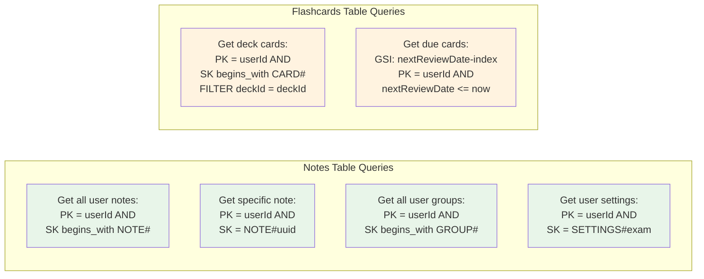

---

## Component Hierarchy

```mermaid
graph TD
    App[RootLayout]
    App --> Providers[Provider Stack]

    Providers --> Amplify[AmplifyProvider]
    Providers --> Theme[ThemeProvider]
    Providers --> Toast[ToastProvider]
    Providers --> Confirm[ConfirmProvider]
    Providers --> Auth[AuthProvider]

    App --> Dashboard[Dashboard Layout]

    Dashboard --> NotesRoute[/notes]
    Dashboard --> ChatRoute[/chat]
    Dashboard --> FlashcardsRoute[/flashcards]
    Dashboard --> DashboardRoute[/dashboard]

    NotesRoute --> NotesProvider1[NotesProvider]
    NotesRoute --> GroupsProvider1[GroupsProvider]
    NotesRoute --> NotesList[NotesList]
    NotesList --> NoteCard[NoteCard]
    NotesList --> GroupsSidebar

    ChatRoute --> NotesProvider2[NotesProvider - Isolated]
    ChatRoute --> GroupsProvider2[GroupsProvider]
    ChatRoute --> ChatInterface
    ChatInterface --> ChatMessage
    ChatInterface --> ChatInput
    ChatInterface --> ModelSelector

    FlashcardsRoute --> FlashcardsList
    FlashcardsList --> FlashcardCard
    FlashcardsList --> AIFlashcardGenerator

    DashboardRoute --> ExamCountdown
    DashboardRoute --> DailyGoals
    DashboardRoute --> StatsCards

    NotesRoute --> NewNotePage[/notes/new]
    NotesRoute --> EditNotePage[/notes/[id]]
    NotesRoute --> ViewNotePage[/notes/[id]/view]

    NewNotePage --> NoteEditor
    EditNotePage --> NoteEditor
    ViewNotePage --> AIExplainPanel

    style NotesProvider1 fill:#FFE0B2
    style NotesProvider2 fill:#FFE0B2
    style GroupsProvider1 fill:#C8E6C9
    style GroupsProvider2 fill:#C8E6C9

    Note1[Note: Chat page has its own<br/>isolated NotesProvider instance]
    style Note1 fill:#FFCDD2
```

---

## GraphQL API Schema

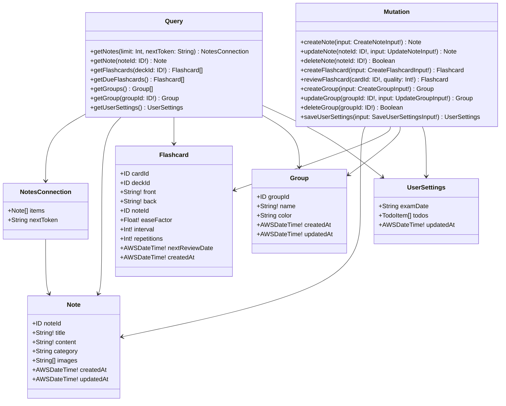

---

## State Management Flow

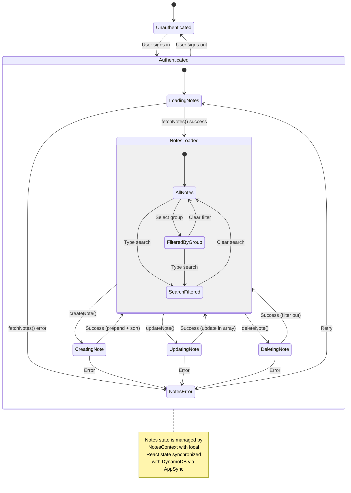

---

## Environment Configuration

```mermaid
graph TB
    subgraph "Environment Variables"
        ENV[.env.local]
        ENV --> AWS[AWS Configuration]
        ENV --> AI[AI Services]

        AWS --> Region[NEXT_PUBLIC_AWS_REGION]
        AWS --> Cognito[NEXT_PUBLIC_COGNITO_*]
        AWS --> AppSyncURL[NEXT_PUBLIC_APPSYNC_ENDPOINT]
        AWS --> S3Bucket[NEXT_PUBLIC_S3_BUCKET]
        AWS --> CloudFrontURL[NEXT_PUBLIC_CLOUDFRONT_URL]

        AI --> OpenAIKey[OPENAI_API_KEY]
        AI --> AnthropicKey[ANTHROPIC_API_KEY]
        AI --> MoonshotKey[MOONSHOT_API_KEY]
        AI --> AWSAccess[AWS_ACCESS_KEY_ID]
        AI --> AWSSecret[AWS_SECRET_ACCESS_KEY]
    end

    subgraph "Runtime Configuration"
        AmplifyConfig[AmplifyProvider]
        AmplifyConfig --> AuthConfig[Cognito User Pool]
        AmplifyConfig --> APIConfig[GraphQL Endpoint]
        AmplifyConfig --> StorageConfig[S3 Bucket]
    end

    ENV --> AmplifyConfig

    style ENV fill:#FFF9C4
    style AmplifyConfig fill:#C5E1A5
```

---

## Deployment Architecture

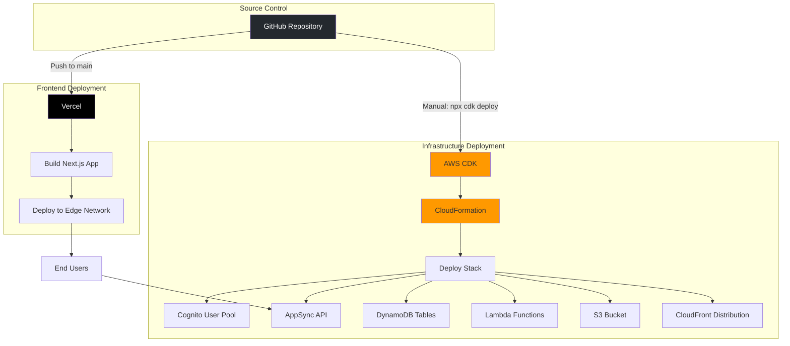

---

## Key Features & Flows

### Notes Feature
- ✅ Create, read, update, delete notes
- ✅ Rich text editing with TipTap (bold, italic, headings, lists, code blocks, images)
- ✅ Group/category organization
- ✅ Search across title and content
- ✅ Filter by group or ungrouped
- ✅ Image upload to S3 with CloudFront delivery
- ✅ AI-powered summarization and explanation
- ✅ Alphabetical sorting by title
- ✅ Pagination support for 1000+ notes

### AI Tutor Feature
- ✅ Multiple AI models (GPT-4, Claude, Moonshot)
- ✅ Streaming responses
- ✅ Save chat responses as notes
- ✅ Markdown to HTML conversion
- ✅ Auto-title generation from content
- ✅ Content size validation (350KB limit)

### Flashcards Feature
- ✅ Spaced repetition using SM-2 algorithm
- ✅ Link flashcards to notes
- ✅ AI-generated flashcards from notes
- ✅ Due date tracking with GSI
- ✅ Quality ratings (0-5) adjust review intervals

### Groups Feature
- ✅ Color-coded categories
- ✅ Sidebar navigation
- ✅ Alphabetical sorting
- ✅ Note count per group
- ✅ Ungrouped notes support

### Dashboard Feature
- ✅ Exam countdown timer
- ✅ Daily goals checklist
- ✅ Study statistics

---

## Security Model

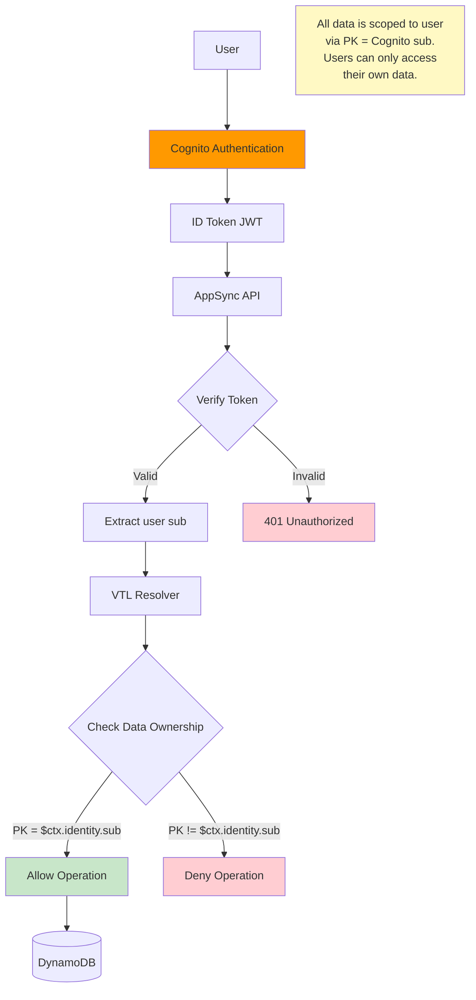

---

## Performance Optimizations

1. **Pagination**: Notes and flashcards support pagination to handle large datasets
2. **Consistent Reads**: DynamoDB queries use `consistentRead: true` for data accuracy
3. **Alphabetical Sorting**: Client-side sorting for predictable ordering
4. **CloudFront CDN**: Images cached at edge locations
5. **Pay-per-request Billing**: DynamoDB scales automatically without capacity planning
6. **Streaming AI Responses**: Real-time display of AI-generated content
7. **Local State Management**: React Context reduces unnecessary API calls
8. **Presigned URLs**: Direct S3 uploads bypass backend processing

---

## Known Issues & Solutions

### Issue 1: Notes Not Displaying (RESOLVED)
**Problem**: Only 50 out of 144 notes were visible
**Root Cause**: Missing pagination support in `getNotes` resolver
**Solution**: Added `limit` and `nextToken` parameters with automatic pagination loop

### Issue 2: Save-to-Notes Silent Failure (RESOLVED)
**Problem**: AI tutor save appeared successful but note wasn't in database
**Root Cause**: Missing error handling in AppSync resolver response template
**Solution**: Added `$ctx.error` check in VTL response templates

### Issue 3: Isolated Context Instances
**Problem**: Chat page has separate NotesProvider instance from main notes page
**Status**: By design - each page manages its own state
**Impact**: Saving note in chat doesn't update notes page until refresh

### Issue 4: Race Condition Risk
**Problem**: `fetchNotes()` can overwrite `createNote()` state updates
**Status**: Low impact - rare occurrence
**Mitigation**: State updates use functional setters

---

## Future Enhancements

- [ ] Real-time collaboration with WebSockets
- [ ] Note version history
- [ ] Export notes to PDF/Markdown
- [ ] Advanced search with filters (date, tags, AI-powered semantic search)
- [ ] Mobile app with offline support
- [ ] Note sharing with other users
- [ ] Integration with AWS certification practice exams
- [ ] Analytics dashboard for study progress
- [ ] Voice notes with transcription
- [ ] Browser extension for quick note capture
